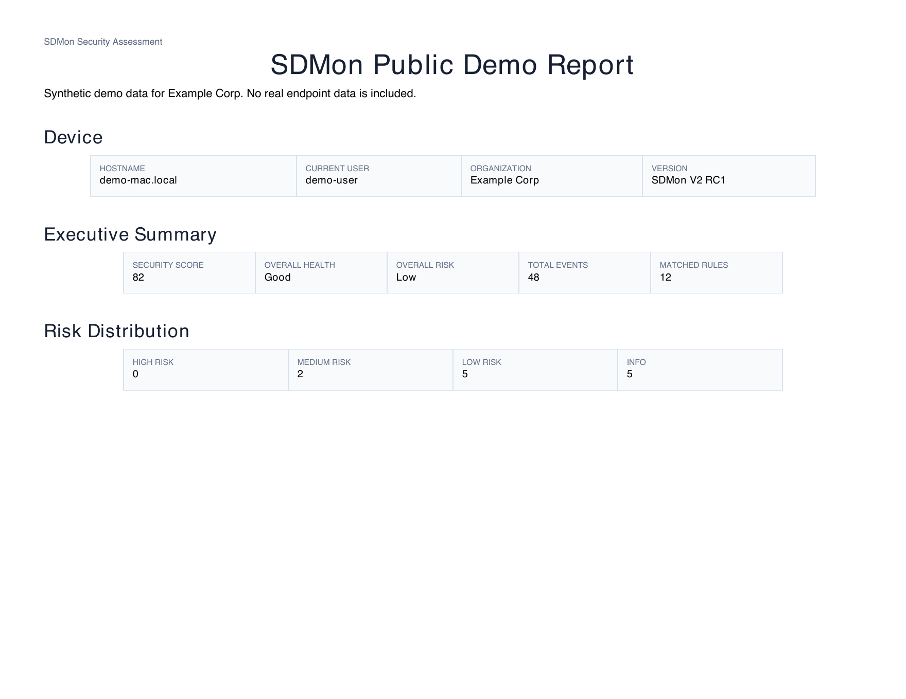
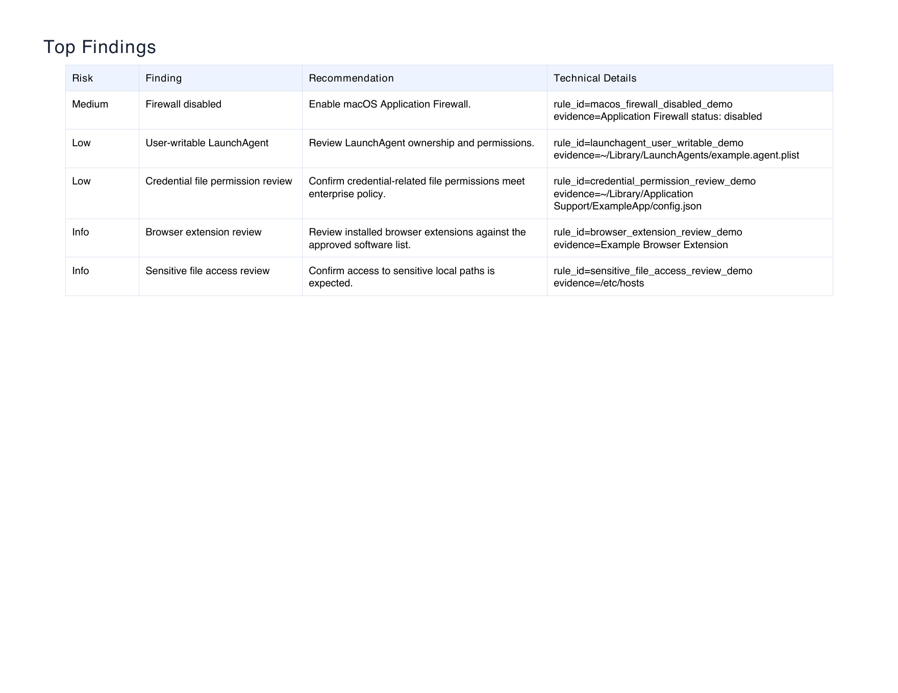
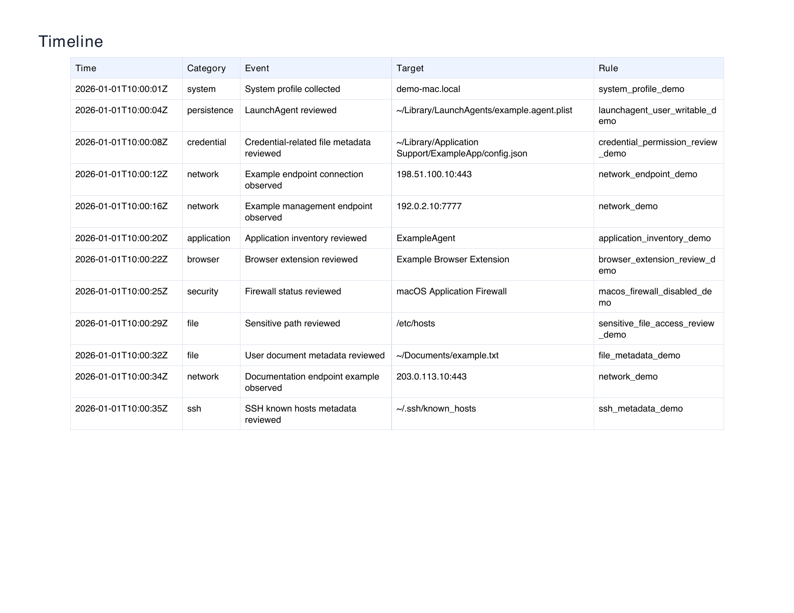

# SDMon

Enterprise Security Assessment Toolkit



Generate enterprise-grade macOS endpoint security assessment reports with one command.

- One Command
- Read-only
- Local Analysis
- No cloud dependency
- HTML / PDF / JSON / CSV / ZIP reports
- Executive Summary
- Technical Details

> Public Preview
>
> Current version: `v2.0.0-rc1`
>
> macOS-first. Windows and Linux are planned in Beta.
>
> Designed for evaluation. False positives are expected. SDMon is not a replacement for EDR, MDM, VPN, antivirus, or SOC platforms.

## What is SDMon?

SDMon is a local, read-only macOS security assessment toolkit for enterprise IT and security teams.

It collects endpoint behavior and configuration signals, runs local rule matching, and generates an executive-friendly report package that can be reviewed, printed, archived, or shared internally.

SDMon does not block, remove, isolate, unload, modify, or remediate anything on the endpoint.

## Before You Start

SDMon `v2.0.0-rc1` currently supports macOS in the public release.

Windows support is under Beta development in a separate branch and pull request. It is not part of the `v2.0.0-rc1` public preview release yet.

If you use `git clone` on a fresh Mac, macOS may ask you to install Apple Command Line Tools first:

```bash
xcode-select --install
```

After installation, verify Git is available:

```bash
git --version
```

## Quick Start

### Option 1: Run With Git

```bash
git clone https://github.com/chyin1006/SDMon.git
cd SDMon
chmod +x sdmon-v2.sh
./sdmon-v2.sh
```

### Option 2: Run From GitHub ZIP

Use this option if Git is not installed yet.

1. Open the SDMon GitHub page.
2. Select **Code** -> **Download ZIP**.
3. Extract the ZIP file.
4. Open Terminal in the extracted folder.
5. Run:

```bash
chmod +x sdmon-v2.sh
./sdmon-v2.sh
```

SDMon runs locally, asks for administrator permission once when required, writes reports to `output/`, and opens `output/report.html` on macOS.

Terminal screenshot coming soon.

## Report Preview

### Report Home


### Executive Summary


### Top Findings



### Timeline



## Demo Artifacts

- `examples/report/demo-report.html`
- `examples/report/demo-report.pdf`
- `examples/report/demo-report.zip`

## Features

| Feature | Description |
| --- | --- |
| One Command | `./sdmon-v2.sh` runs the complete local scan and opens the report. |
| Read-only | SDMon collects local signals without modifying agents, settings, files, or services. |
| Local Analysis | Events, rules, analysis, and reports are processed on the endpoint. |
| No Cloud Dependency | No upload is required for the RC1 workflow. |
| Enterprise Report | Generates HTML, PDF, JSON, CSV, ZIP, and `summary.txt`. |
| Executive Summary | Shows Security Score, Overall Risk, Top Findings, and Recommendations. |
| Technical Details | Keeps evidence, rule IDs, paths, and raw context behind expandable details. |

## Why SDMon?

| Capability | SDMon | EDR | MDM |
| --- | --- | --- | --- |
| Read-only assessment | Yes | Partial | Partial |
| Enterprise report | Yes | Partial | No |
| Offline analysis | Yes | No | No |
| Real-time protection | No | Yes | No |
| System configuration enforcement | No | Partial | Yes |
| One-command scan | Yes | No | No |

SDMon is not EDR, not MDM, and not antivirus. It is a lightweight assessment and reporting toolkit for understanding endpoint posture and agent behavior.

## Detection Coverage

| Module | Purpose |
| --- | --- |
| System | Host, user, OS, CPU, memory, and scan context. |
| Persistence | LaunchAgent and LaunchDaemon review. |
| Network | Local connection and exposure signals. |
| Browser | Browser extension and application trust signals. |
| Credential | Credential-related file metadata without reading secret values. |
| Sensitive Files | Sensitive local paths and permission outcomes. |
| Firewall | macOS Application Firewall status. |
| FileVault | Disk encryption status. |
| AI Agent | Local AI-tool-related agent signals when present. |
| Rule Engine | Local rule matching over normalized events. |
| Reporter | HTML, PDF, ZIP, JSON, CSV, and Summary outputs. |

## Use Cases

- Enterprise IT endpoint review.
- Security team triage.
- Compliance evidence collection.
- Internal audit.
- Customer delivery reports.
- Endpoint management validation.
- Local agent behavior assessment.

## Supported Platforms

| Platform | Status | Notes |
| --- | --- | --- |
| macOS | Current | V2 RC1 is macOS-first. |
| Windows | Planned | Coming in Beta. |
| Linux | Planned | Coming in Beta. |

## Current Release

| Item | Value |
| --- | --- |
| Version | `v2.0.0-rc1` |
| Status | Public Preview |
| Focus | macOS local assessment |
| Output | HTML, PDF, ZIP, JSON, CSV, Summary |
| Data handling | Local output only |
| Risk note | False positives are expected during RC evaluation. |

Default output files:

```text
output/report.html
output/report.pdf
output/report.zip
output/report.json
output/report.csv
output/summary.txt
output/timeline.json
output/events.json
```

## Roadmap

```text
RC1 Public Preview
  |
Beta
  |-- Windows support
  |-- Linux support
  |-- SQLite event store
  |-- Rule manager
  |-- IOC / MITRE mapping
  |-- Dashboard
  |
Stable
```

## Safety Notes

SDMon does not:

- Stop, uninstall, or modify target agents.
- Change system settings.
- Upload reports or events.
- Read secret values.
- Replace EDR, MDM, VPN, antivirus, or SOC platforms.
- Perform automatic remediation.

## Documentation

- `docs/RELEASE_NOTES_RC1.md`: RC1 release notes.
- `docs/RC1_RELEASE_CHECKLIST.md`: RC1 release checklist.
- `examples/README.md`: examples and first-rule walkthrough.
- `CHANGELOG.md`: project change history.
- `CONTRIBUTING.md`: contribution guide.
- `SECURITY.md`: security policy.
- `PROJECT_INDEX.md`: project knowledge entry point.

## License

SDMon is released under the MIT License. See `LICENSE`.
